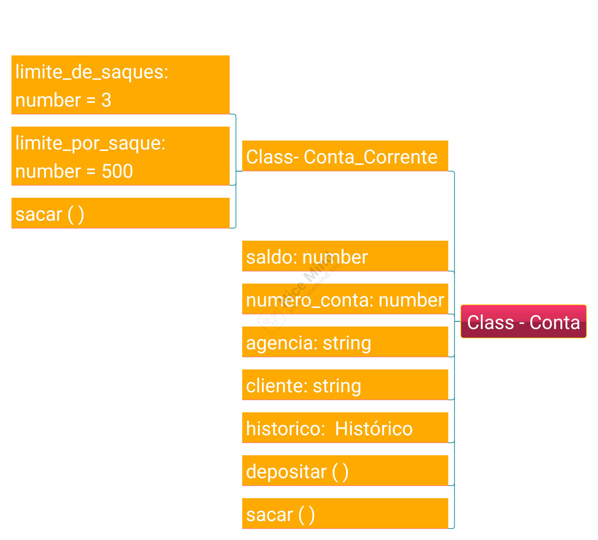
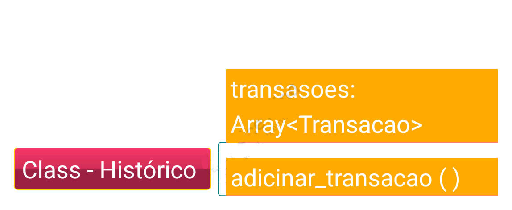
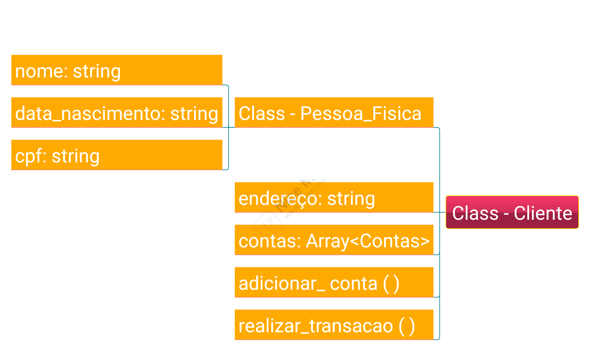
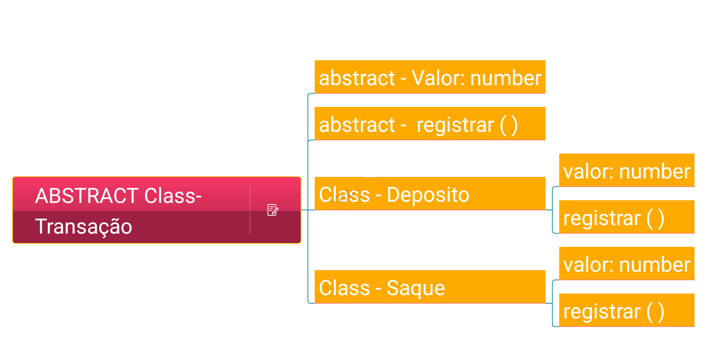

## POO

A Programação Orientada a Objetos (POO) é um paradigma de programação que se baseia no conceito de "objetos", que representam entidades do mundo real com características (atributos) e comportamentos (métodos). A POO enfatiza a organização do código em unidades autônomas e reutilizáveis, facilitando o desenvolvimento, manutenção e compreensão de sistemas complexos.


## Documentação: 

### Indices

- [Classe Conta](#Classe_Conta)
- [Classe Conta corrente](#Classe_Conta_corrente)
- [Classe Historico](#Classe_Historico)
- [Classe Cliente](#Classe_cliente)
- [Classe Pessoa fisica](#Classe_Pessoa_fisica)
- [Classe Transação](#Classe_Transacao)





### Classe_Conta

A classe `Conta` implementa as funções principais de uma conta bancária. 
OBS: não deve ser instanciada diretamente.

####  instânciando:

```typescript
const conta = new Conta(1, "client name", "batatinhasfritas123")
```

### Atributos:
<details>
  <summary>Saldo -- click para mais informações.</summary>

  - **type**: Number
  - **state**: PRIVADO
  - **description**: saldo atual da conta
  - **default**: 0
  - **optional**: True
</details>

<details>
  <summary>Agência -- click para mais informações.</summary>

  - **type**: String
  - **state**: PUBLIC
  - **description**: número da agência.
  - **default**: 0001
  - **optional**: True
</details>

<details>
  <summary>Historico -- click para mais informações.</summary>

  - **type**: Array Histórico.
  - **state**: PUBLIC
  - **description**: O histórico de transações da conta.
  - **default**: []
  - **optional**: True
</details>

<details>
  <summary>Senha -- click para mais informações.</summary>

  - **type**: String
  - **state**: PRIVATE
  - **description**: A senha de acesso à conta.
  - **optional**: False
</details>

<details>
  <summary>Número -- click para mais informações.</summary>

  - **type**: Number
  - **state**: PUBLIC
  - **description**: O número da conta.
  - **optional**: False
</details>

<details>
  <summary>Cliente -- click para mais informações.</summary>

  - **type**: String
  - **state**: PUBLIC
  - **description**: O nome do cliente associado à conta.
  - **optional**: False
</details>

### Métodos:
<details>
  <summary>conta_saldo [GETTER] -- click para mais informações.</summary>

  - **type**: Number
  - **description**: Retorna o valor de saldo.

  ```typescript
  const saldo = conta.Conta_saldo
  ```
</details>

<details>
  <summary>conta_numero [GETTER] -- click para mais informações.</summary>

  - **type**: Number
  - **description**: Retorna o número da conta.

  ```typescript
  const numero = conta.Conta_numero
  ```
</details>

<details>
  <summary>Conta_senha [GETTER] -- click para mais informações.</summary>

  - **type**: String
  - **description**: Retorna a senha da conta.

  ```typescript
  const senha = conta.Conta_senha
  ```
</details>

<details>
  <summary>Conta_historico [GETTER] -- click para mais informações.</summary>

  - **type**: Array Historico
  - **description**: Retorna a lista de transações da conta.

  ```typescript
  const historico = conta.Conta_historico
  ```

  retorno 
  ```typescript
  Historico {
	transacoes: [
	  { tipo: 'DEPOSITO', valor: 400, data: '24/08/2024, 18:05:12' },
	  { tipo: 'SAQUE', valor: 30, data: '24/08/2024, 18:05:12' }
	]
  }
  ```
</details>

<details>
  <summary>Conta_sacar -- click para mais informações.</summary>

  - **return type**: Void
  - **parametrô**: valor -- **number**
  - **description**: Decrementa o valor de saldo da conta.

  ```typescript
  conta.Conta_sacar(50)
  ```
</details>

<details>
  <summary>Conta_depositar -- click para mais informações.</summary>

  - **return type**: Void
  - **parametrô**: valor -- **number**
  - **description**: Incrementa o valor de saldo da conta.

  ```typescript
  conta.Conta_depositar(50)
  ```
</details>


===============================================================================================


### Classe_Conta_corrente

A classe `Conta corrente` é uma subclasse de `conta` e adiciona funcionalidades específicas para uma conta corrente.

####  instânciando:

```typescript
const conta_corrente = new Conta_corrente(1, "client name", "batatinhasfritas123")
```

### Atributos:
<details>
  <summary>limite_saques -- click para mais informações.</summary>

  - **type**: Number
  - **state**: PUBLIC
  - **description**: Limite de saques que o usúario pode fazer por dia
  - **default**: 3
  - **optional**: True
</details>

<details>
  <summary>limite_por_saque -- click para mais informações.</summary>

  - **type**: Number
  - **state**: PUBLIC
  - **description**: Valor limite de saque.
  - **default**: 500
  - **optional**: True
</details>

### Métodos:
<details>
  <summary>verificarValor -- click para mais informações.</summary>

  - **return type**: Boolean
  - **parametro**: valor - **Number**
  - **state**: PRIVADO
  - **description**: Verificar se o valor passado é menor ou igual que o saldo disponivel.

  ```typescript
  // exemplo saldo = 50
  conta.verficarValor(50) // true
  conta.verficarValor(500) // false
  ```
</details>

<details>
  <summary>verificarSaldo -- click para mais informações.</summary>

  - **return type**: Boolean
  - **parametro**: none
  - **state**: PRIVADO
  - **description**: Verificar se há algum saldo na conta.

  ```typescript
  /*
    exemplo 
    saldo disponivel = 500
  */
  conta.verificarSaldo() // true

  ```
</details>

<details>
  <summary>verificarLimites -- click para mais informações.</summary>

  - **return type**: Boolean
  - **parametro**: valor - **Number**
  - **state**: PRIVADO
  - **description**: Verificar se os limites de saques e valor não foram excedidos.

  ```typescript
  /*
    exemplo 
    saques efetuados = 2
    limite = 500
  */
  conta.verificarLimites(50) // true
  conta.verificarLimites(700) // false
  ```
</details>

<details>
  <summary>depositar -- click para mais informações.</summary>

  - **return type**: Boolean
  - **parametro**: valor - **Number**
  - **state**: PUBLIC
  - **description**: Executa uma verificaão antes de efetuar a transação.

  ```typescript
  //valor inserido não pode ser igual ou menor que -0
  conta.depositar(50) // true
  conta.depositar(0) // false
  conta.depositar(-10) // false
  
  ```
</details>

<details>
  <summary>sacar -- click para mais informações.</summary>

  - **return type**: Boolean
  - **parametro**: valor - **Number**
  - **state**: PUBLIC
  - **description**: Executa uma verificaão antes de efetuar a transação.

  ```typescript
  conta.sacar(50)
  ```
</details>





### Classe_Historico

A classe `Historico` gerencia e armazena uma lista de transações financeiras, permitindo adicionar novas transações e acessar o histórico existente.

#### Instânciando:

```typescript
const historico = new Historico();
```

### Atributos:
<details>
  <summary>transacoes -- click para mais informações.</summary>

  - **type**: transacao[]
  - **state**: Private
  - **description**: Lista de transações feitas na conta.
  - **default**: []
  - **optional**: false
</details>

### Métodos:
<details>
  <summary>Transacoes [GETTER] -- click para mais informações.</summary>

  - **type**: Transacao[]
  - **description**: Retorna o historico.

  ```typescript
  const historico = new Historico()
  const transacoes = historico.Transacoes
  ```
</details>

<details>
  <summary>nova_transacao -- click para mais informações.</summary>

  - **return type**: Void
  - **parametro**: valor - **Number**, tipo - **"Saque" || "Deposito"**, data - **Date**
  - **state**: PUBLIC
  - **description**: Adiciona uma nova transação ao historico.

  ```typescript
  const historico = new Historico()
  const transacoes = historico.nova_transacao("Saque", 100, new Date(2024, 8, 24))
  ```
</details>





### Classe_cliente

A classe `Cliente` implementa a base de um registro de usuário  e herda suas propriedade para a classe `Pessoa_fisica`

####  instânciando:

```typescript
const cliente = new Cliente()
```

### Atributos:
<details>
  <summary>contas -- click para mais informações.</summary>

  - **type**: Conta_corrente[]
  - **state**: PUBLIC
  - **description**: Lista de contas vinculadas a um usuário.
  - **default**: []
  - **optional**: false
</details>

### Métodos:
<details>
  <summary>adicionar_conta -- click para mais informações.</summary>

  - **return type**: void
  - **parametro**: conta - **conta_corrente**
  - **state**: PUBLIC
  - **description**: vincula uma nova conta ao usuário.

  ```typescript
  cliente.adcionar_conta(conta)
  ```
</details>

<details>
  <summary>realizar_transacao -- click para mais informações.</summary>

  - **return type**: void
  - **parametro**: transacao - **transacao**
  - **state**: PUBLIC
  - **description**: Registra uma nova transação a conta.

  ```typescript
  cliente.realizar_transacao(transacao)
  ```
</details>


### Classe_Pessoa_fisica

A classe `Pessoa_fisica` extende as propriedades da classe `cliente`

####  instânciando:

```typescript
const pessoa = new Pessoa_fisica("nome", "cpf")
```

### Atributos:
<details>
  <summary>nome -- click para mais informações.</summary>

  - **type**: String
  - **state**: PUBLIC
  - **description**: nome do cliente.
  - **default**: none
  - **optional**:false
</details>

<details>
  <summary>cpf -- click para mais informações.</summary>

  - **type**: String
  - **state**: PUBLIC
  - **description**: cpf do cliente.
  - **default**: none
  - **optional**:false
</details>





### Classe_Transacao

Classe `transacao` é uma classe abstrata. classes abstratas são classes que não podem ser instanciadas diretamento, ou seja voê não pode instanciar um objetos a partir dela. classes abstratas servem como base para outras classes definindo metodos que devem ser implementados por suas aubclasses

### Atributos:
<details>
  <summary>Valor -- click para mais informações.</summary>

  - **type**: Number
  - **state**: PUBLIC
  - **description**: O valor da transação.
  - **default**: none
  - **optional**: false
</details>

### Métodos:
<details>
  <summary>registrar -- click para mais informações.</summary>

  - **return type**: Void
  - **parametro**: conta - **Conta_corrente**
  - **state**: ABSTRACT
  - **description**: metodo a ser implementado.
</details>


### Classes_Saque_Deposito

Ambas as classes implementam os atributos de Transação e servem como modelos e para gerar novas transações.

####  instânciando:

```typescript
const saque = new Saque(500)
const deposito = new Deposito(500)
```

### Atributos:
<details>
  <summary>Valor -- click para mais informações.</summary>

  - **type**: Number
  - **state**: PUBLIC
  - **description**: O valor da transação.
  - **default**: none
  - **optional**: false
</details>

### Métodos:
<details>
  <summary>registrar -- click para mais informações.</summary>

  - **return type**: Void
  - **parametro**: conta - **Conta_corrente**
  - **state**: ABSTRACT
  - **description**: executa uma nova transação e registra no historico da conta caso sucesso..
</details>