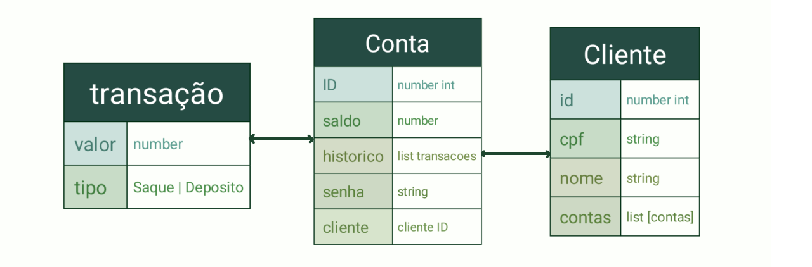

# Mini sistema Bancário.

Bem-vindo ao meu projeto de estudos! Este projeto visa implementar a ideia de um sistema bancário simples feito com TypeScript. 

## Contexto:
Imagine que lhe é dado a tarefa de criar um sistema bancário simples, utilizando programação orientada a objetos, testes unitário, sistema de cadastro que rode no terminal e a documentação da classes criadas.

## regras:
- usuário deve ser capaz de cadastrar um novo cliente. (Não podendo haver cliente duplicado.)
- cada cliente pode criar quantas contas quiserem
- o usuário deve ser capaz de
  - ver o extrato da conta
  - efetuar saques e depositos

**OBJETIVO**: Utilizar os recursos e a tipagem estática forte que a linguagem TypeScript oferece, além do paradigma de orientação a objetos para implementar classes que serão utilizadas na construção do código, além de estudar e praticar essas tecnologias, que são o principal foco.

**OBSERVAÇÃO**: Este é um projeto de estudos (ficcional).

**CRÉDITO**: A ideia deste projeto foi desenvolvida no bootcamp de programação backend em Python fornecido pela DIO.me. Apenas implementei uma solução usando uma linguagem que gosto mais.

Link para mais [informações:](https://www.dio.me/)

Link para a documentação das classes:  [DOCS](DOCUMENTACAO.md)